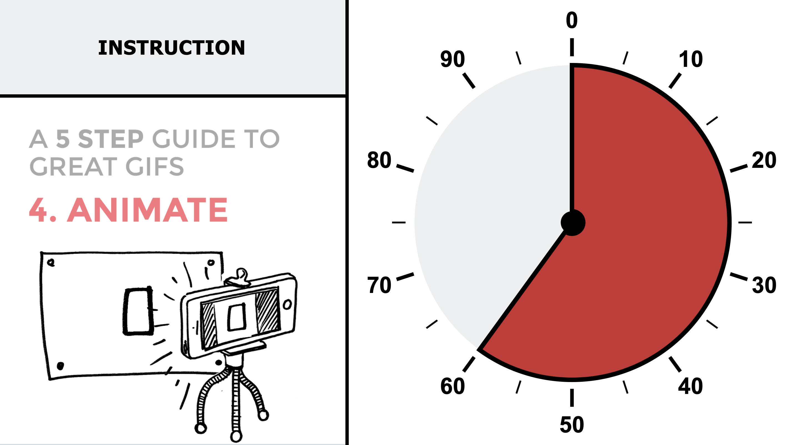

# Kiosk System



A lightweight real-time kiosk display powered by **Node.js**, designed to let an external device or remote machine control a fullscreen web interface through simple HTTP requests.

Originally built to assist users while operating a specific machine, the interface combines:

* **Instruction text** for guidance
* **Animated GIFs** for visual actions
* **Circular progress gauge** to show remaining effort or progress

The orginally used device was a **Raspberry Pi 3 Model B v1.2** running **Raspberry Pi OS (Legacy, 32-bit)**, but the project can run on most Linux devices

---

## Features

* Real-time updates via WebSockets
* Simple HTTP API for remote control
* Fullscreen kiosk interface
* Lightweight and fast
* Easy deployment on Raspberry Pi or mini PCs

---

## Project Structure

```text
.
├── README.md
├── autolaunch.sh              # Starts the server and kiosk interface
├── server/
│   ├── package.json
│   └── server.js              # Express + Socket.IO backend
└── web/
    ├── index.html             # Main kiosk page
    ├── style.css              # Interface styling
    ├── gifs/                  # Animation assets
    └── js/
        ├── socket.js          # WebSocket connection
        ├── gauge.js           # Gauge rendering logic
        ├── gif.js             # GIF switching logic
        └── text.js            # Text update logic
```

---

## How It Works

The Node.js server acts as a bridge between remote commands and connected kiosk screens.

### Workflow

1. A browser opens the kiosk interface.
2. The interface connects to the server using WebSockets.
3. A remote device sends an HTTP request.
4. The server receives the request and broadcasts the update instantly.
5. All connected kiosk screens refresh in real time without reloading.

---

## Requirements

Before installation, make sure you have:

* **Node.js** installed
* A Linux system (recommended)
* A browser such as Chromium

---

## Installation

### 1. Clone the Project

```bash
git clone <your-repository-url>
cd kiosk
```

### 2. Install Dependencies

```bash
cd server
npm install
```

### 3. Install Cage

Cage is a minimal Wayland compositor ideal for launching a single fullscreen application.

```bash
sudo apt update
sudo apt install cage
```

### 4. Make the Launch Script Executable

```bash
chmod +x autolaunch.sh
```

---

## Auto Start on Boot

To automatically launch the kiosk when the device starts, edit your shell profile:

```bash
nano ~/.bash_profile
```

Add:

```bash
if [ -z "$DISPLAY" ] && [ "$XDG_VTNR" = 1 ]; then
  exec cage ./autolaunch.sh
fi
```

This will checks that no graphical session is already running. Ensures login is on virtual terminal **TTY1**. Launches Cage in fullscreen mode and runs your kiosk automatically at boot

This prevents multiple sessions from starting the kiosk accidentally.

---

## Running the Project

### Start Manually

```bash
./autolaunch.sh
```

### Or Reboot the Device

If auto-start is configured, the kiosk will launch automatically.

---

## Accessing the Interface

From any device on the network, open:

```text
http://[DEVICE-HOSTING-SERVER-IP]:3000
```

Replace `3000` if you changed the port inside `autolaunch.sh` or `server.js`.

---

## Remote Control API

The server accepts HTTP GET requests and pushes updates instantly to all connected clients.

### Update Gauge

Set the progress gauge from **0 to 100**.

```http
GET /update-gauge/:value
```

Example:

```bash
curl http://localhost:3000/update-gauge/85
```

---

### Update Text

Change the displayed instruction text.

```http
GET /update-text/:text
```

Example:

```bash
curl http://localhost:3000/update-text/STOP
```

---

### Update GIF

Switch the displayed animation.

```http
GET /update-gif/:name
```

Example:

```bash
curl http://localhost:3000/update-gif/demo
```

This will typically load:

```text
web/gifs/demo.gif
```

(depending on your implementation)

---

### Relay Control

Coming soon.

---

## Recommended Optimizations for Raspberry Pi

If using a Raspberry Pi or similar device:

* Disable unused desktop environments
* Boot directly to console mode
* Use lightweight browser flags
* Reduce background services
* Use wired Ethernet for stable communication

## License

This project is licensed under the MIT License.
Copyright © 2026 Mathys Bitsch.

---

## Summary

This project transforms any small computer into a remotely controlled smart display using only:

* Node.js
* A browser
* Simple HTTP requests

Reliable, lightweight, and ideal for embedded kiosk systems.
